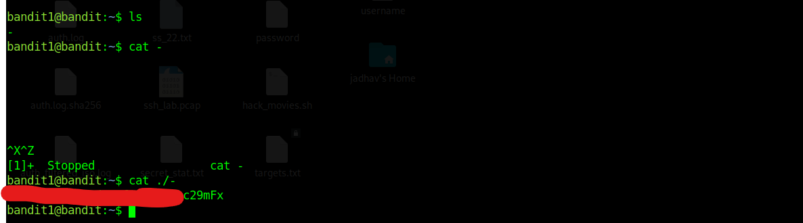

# Bandit Level 1

 

## Objective

Use the password obtained from Bandit Level 0 to log in to Bandit Level 1 and find the password for Bandit Level 2.

# Step 1: Log in to Bandit Level 1

In the previous level, we discovered the password for the `bandit1` user.

Using that password, we connect to the Bandit server as `bandit1`.

### Command

```bash
ssh bandit1@bandit.labs.overthewire.org -p 2220
```

### General Syntax

```bash
ssh <username>@<hostname> -p <port>
```

### Explanation

| Part     | Meaning                            |
| -------- | ---------------------------------- |
| ssh      | Secure Shell client                |
| username | User account to log in as          |
| hostname | Remote server address              |
| -p       | Specifies the port number          |
| 2220     | SSH port used by the Bandit server |

After running the command, enter the password obtained from Bandit Level 0.


# Step 2: Examine the Current Directory

After successfully logging in, list the files present in the current directory.

### Command

```bash
ls
```

### General Syntax

```bash
ls [options] [directory]
```

### Output

```text
-
```

A file named `-` is present in the directory.


# Step 3: Try Reading the File

A natural first attempt is:

### Command

```bash
cat -
```

### Result

This does not work as expected.

Linux treats `-` as a special symbol rather than a normal filename.


# Step 4: Access the File Using a Relative Path

To tell Linux that `-` is a filename, specify its path explicitly.

### Command

```bash
cat ./-
```

### Explanation

`./` refers to the current directory.

By adding `./`, Linux understands that `-` is a file located in the current directory.

### Breakdown

| Part | Meaning           |
| ---- | ----------------- |
| .    | Current directory |
| /    | Path separator    |
| -    | Filename          |

### Result

The contents of the file are displayed.

The displayed text is the password for Bandit Level 2.

 

# Commands Used

## SSH

### Purpose

Connect to a remote Linux machine.

### Syntax

```bash
ssh <username>@<hostname> -p <port>
```

## LS

### Purpose

List files and directories.

### Syntax

```bash
ls [options] [directory]
```

## CAT

### Purpose

Display the contents of a file.

### Syntax

```bash
cat <filename>
```


# New Concept Learned

## Relative Paths

### Syntax

```bash
./<filename>
```

### Purpose

Refers to a file located in the current directory.

This is useful when filenames contain special characters or names that Linux may interpret differently.

### Examples

```text
-
file with spaces
$
*
?
!
```

# Commands Mentioned by OverTheWire

| Command | Purpose                          |
| ------- | -------------------------------- |
| ls      | List files and directories       |
| cd      | Change directory                 |
| cat     | Display file contents            |
| file    | Identify file type               |
| du      | Display disk usage               |
| find    | Search for files and directories |


# Key Takeaways

* Used the password from Bandit Level 0 to log in as `bandit1`.
* Learned that filenames can contain special characters.
* Learned that `-` has a special meaning in Linux.
* Learned how to use a relative path (`./`) to access files.
* Obtained the password for Bandit Level 2.
