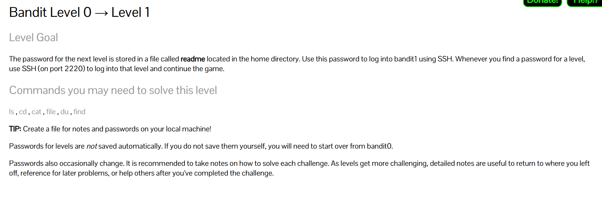

# Bandit Level 1

 

## Objective

Find the password for Bandit Level 2.

# Challenge

A file named `-` exists in the home directory.

The password for the next level is stored inside this file.

# Step 1: List Files

### Command

```bash
ls
```

### Output

```text
-
```

A file named `-` is present.


# Step 2: Read the File

### Attempt

```bash
cat -
```

This does not work as expected because Linux treats `-` as a special symbol.


# Step 3: Access the File Using a Relative Path

### Command

```bash
cat ./-
```

### Explanation

`./` refers to the current directory.

By specifying the path, Linux understands that `-` is a filename and not a special symbol.

### Breakdown

| Part | Meaning |
|--------|---------|
| . | Current directory |
| / | Path separator |
| - | Filename |

# Commands Used

## LS

### Purpose

List files and directories.

### Syntax

```bash
ls [options] [directory]
```


## CAT

### Purpose

Display file contents.

### Syntax

```bash
cat <filename>
```

# New Concept Learned

## Relative Path

### Syntax

```bash
./<filename>
```

### Purpose

Access a file in the current directory.

Useful when filenames contain special characters such as:

```text
-
space
$
*
?
!
```

# Commands Mentioned by OverTheWire

| Command | Purpose |
|----------|----------|
| ls | List files |
| cd | Change directory |
| cat | Display file contents |
| file | Determine file type |
| du | Show disk usage |
| find | Search for files |

# Key Takeaways

- Learned that filenames can contain special characters.
- Learned that `-` has a special meaning in Linux.
- Learned how to use a relative path (`./`) to access files.
- Obtained the password for Bandit Level 2.
